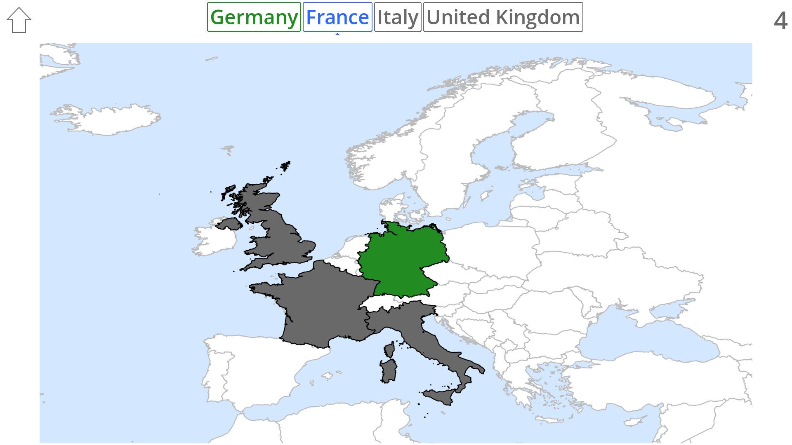

# Blind Map

Blind Map is an educational game that challenges players to learn and memorize geographical facts.

## Maps

The game currently contains following maps:

- Europe (countries)
- Czech Republic (cities, mountains, rivers)
- Great Britain (cities)

## Licenses

Code: MIT

Assets: CC BY 4.0

